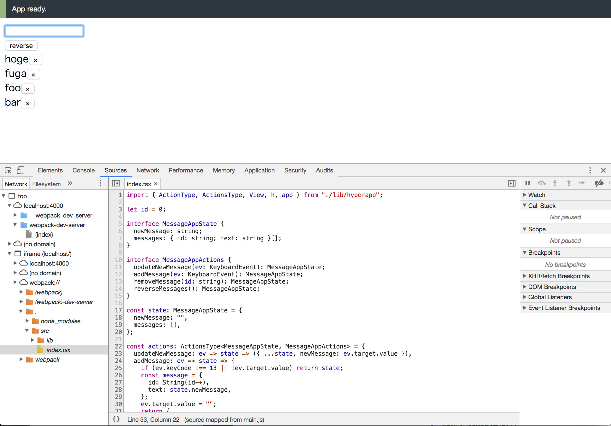

# Virtual DOM のレンダリングの章で使用しているコード

Virtual DOM のレンダリングの章で使用しているコード。

## インストール

```
$ yarn
```

## webpack-dev-server の起動

次のコマンドを実行した後に https://localhost:4000/webpack-dev-server/ にアクセスします。

```
$ yarn serve
```

devtools の Sources タブからデバッグできます。


